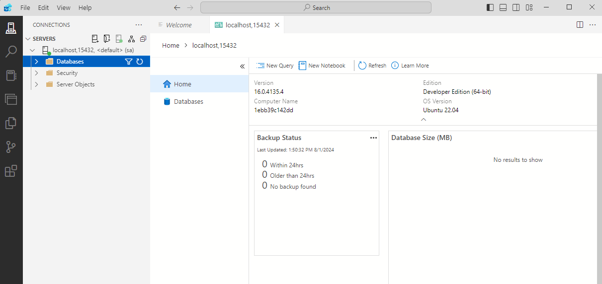
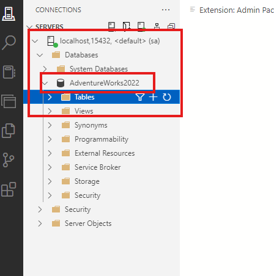
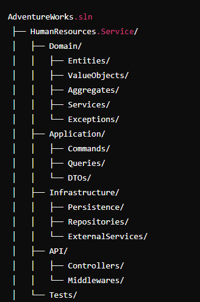

# adventureworksmicroservice
This repository contains a sample microservice project along with the AdventureWorks database.

## Database Choise

Since the AdventureWorks database is necessary and we will be dealing with real-time transactions, we downloaded the AdventureWorks OLTP version.

Then, we download and install the 2022 image of MSSQL.

Commands:
```
"docker pull mcr.microsoft.com/mssql/server"
"docker run -e `ACCEPT_EULA=Y` -e `SA_PASSWORD`=12345678.. -p 15432:1433 --name adventureworksdev -d mcr.microsoft.com/mssql/server"
```
In the command above, we accept the agreement with ACCEPT_EULA. 
With SA_PASSWORD, we set a password for the sa user. 
The -p option specifies that we will access the 1433 port in the container environment through the 15432 port on our host machine. 
The -d option indicates that it will run in the background.

We check if there is a running container using the `docker ps` command.

Output:

| CONTAINER ID | IMAGE | COMMAND | CREATED | STATUS | PORTS | NAMES |
|--------------|-------|---------|---------|--------|-------|-------|
|              |       |         |         |        |       |       |  

Since no running container is listed, let's use the `docker logs <container_id>` command to check the error logs.

Commands:
```
docker logs c24
```
Output:
> ERROR: Unable to set system administrator password: Password validation failed. The password does not meet SQL Server password policy requirements because it is not complex enough. The password must be at least 8 characters long and contain characters from three of the following four sets: Uppercase letters, Lowercase letters, Base 10 digits, and Symbols


Among the logs, we see that the password we entered is not complex enough, which is why the container could not start.

Let's remove the existing container and recreate it with a new password.

Commands:
```
docker rm c24
docker run -e "ACCEPT_EULA=Y" -e "SA_PASSWORD=AdventurePass*123" -p  15432:1433 --name adventureworksdev -d mcr.microsoft.com/mssql/server

```
Output:
> 1ebb39c142dd96ad818609975054a3d3c4bc4bd43991450dbbf82fe08102e1a8

Let's check:

Command:

```
docker ps
```
Output:
| CONTAINER ID | IMAGE                          | COMMAND                | CREATED                | STATUS              | PORTS                        | NAMES                  |
|--------------|--------------------------------|------------------------|------------------------|---------------------|------------------------------|------------------------|
| 1ebb39c142dd | mcr.microsoft.com/mssql/server | "/opt/mssql/bin/perm…" | 47 seconds ago         | Up 46 seconds       |0.0.0.0:15432->1433/tcp       |    adventureworksdev   |
         
We see that our container has been running for 47 seconds.

The next step is to connect using `Azure Data Studio`.



As seen, the connection was established.

When using `Azure Data Studio` the restore process can be a bit cumbersome. Therefore, after a brief search, we discovered an alternative method: transferring our backup file from the local machine to the container.


Let's give it a try.
Command 
> docker cp <source_path> <container_id>:<container_destination_path>

```
docker cp C:\Users\memin\Downloads\AdventureWorks2022.bak 1ebb:/var/backups/AdventureWorks2022.bak
```
Output:
> Successfully copied 210MB to 1ebb:/var/backups/AdventureWorks2022.bak

We see that the file was successfully copied to `/var/backups` within the container.

Next, to use the restore feature in `Azure Data Studio`, we check the "Enable preview features" option in the "Settings." Additionally, we see the restored database under "Databases."



## File Structure And Role Definitions of Microservice Applications According To The DDD (Domain-Driven Design) Pattern

> We will create five microservices soon. But first, we need to define the file structures for these services. We know that most microservice projects are created using the DDD pattern.

> Please look at the below and try to understand the folder structure I shared.

